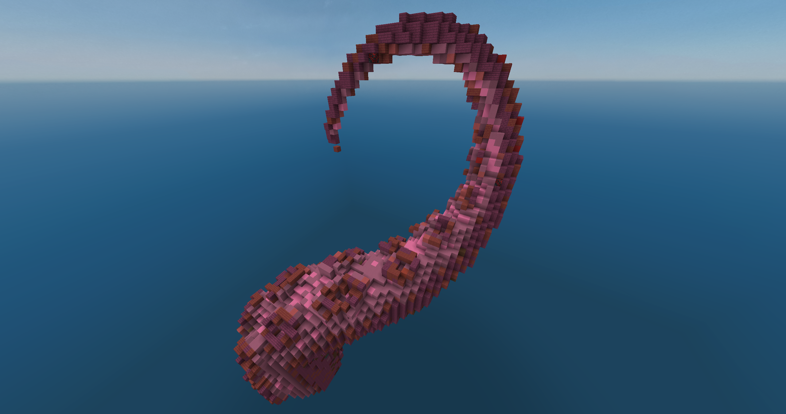
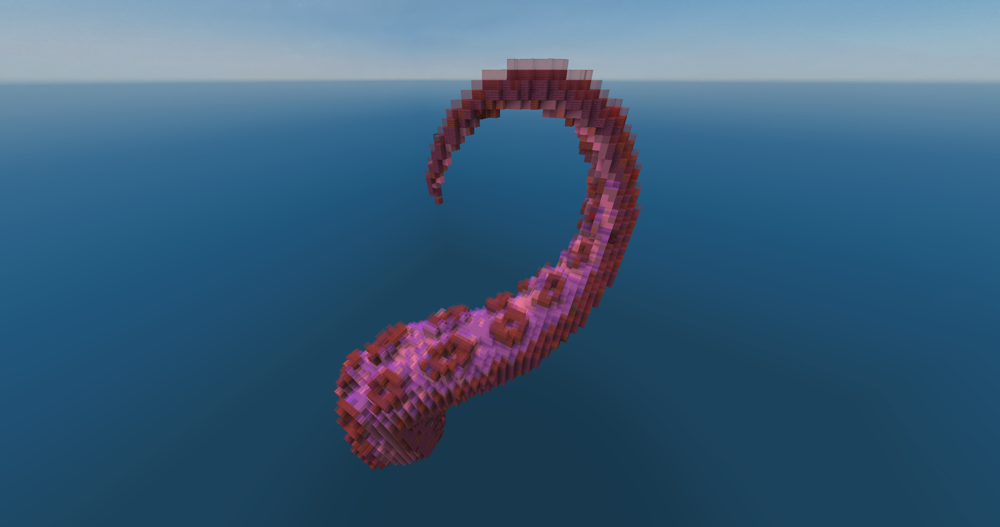

# GlassProofer 
Python Desktop App

Glass Proofer is a local desktop application for marking potential spawnable spaces in Minecraft `.litematic` files with stained glass.

## Before and After

<div style="display: flex; gap: 16px; align-items: flex-start; flex-wrap: wrap;">
  <div style="flex: 1; min-width: 280px;">
    <h3>Before</h3>
    
  </div>

  <div style="flex: 1; min-width: 280px;">
    <h3>After</h3>
    
  </div>
</div>

<div style="display: flex; gap: 16px; align-items: flex-start; flex-wrap: wrap;">
  <div style="flex: 1; min-width: 280px;">
    <h3>Before</h3>
    
  </div>

  <div style="flex: 1; min-width: 280px;">
    <h3>After</h3>
    
  </div>
</div>

## Run locally

```bash
python -m venv .venv
```

Windows PowerShell:

```powershell
.venv\Scripts\Activate.ps1
pip install -r requirements.txt
python run.py
```

macOS/Linux:

```bash
source .venv/bin/activate
pip install -r requirements.txt
python run.py
```

## Build an executable

Windows:

```bat
build_windows.bat
```

macOS/Linux:

```bash
./build_macos_linux.sh
```

The built app will appear in `dist/`.
